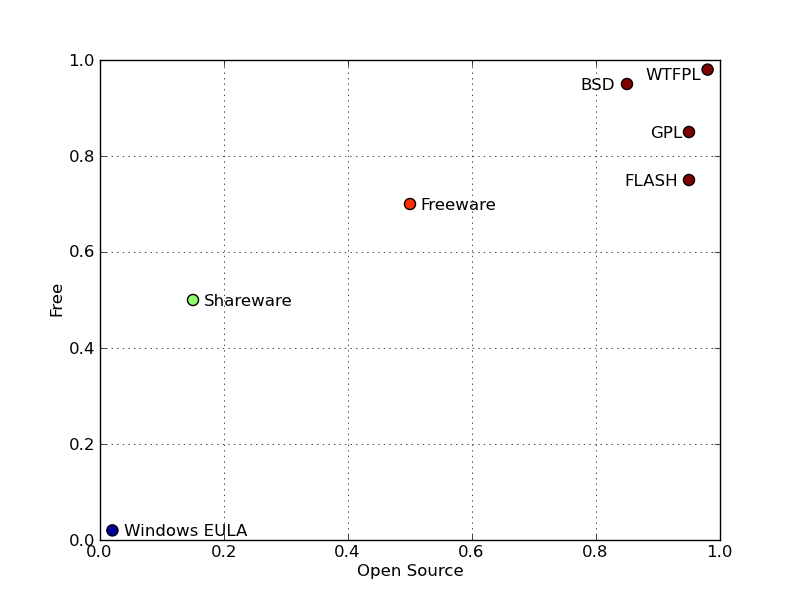
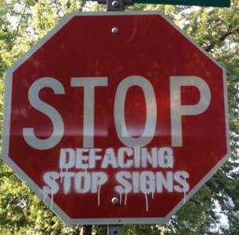

ANS Annual 2012
==============================

.. container:: main-title

    Open, Free, or Me: the Binary in the Coalmine

.. container:: main-names

    June 25th, 2012, ANS, Chicago, IL

    Anthony Scopatz 

    The FLASH Center

    The University of Chicago

    scopatz@flash.uchicago.edu

What is FLASH?
==============================
FLASH code is a modular, parallel multiphysics simulation code for modeling
terrestiral and astrophysical plasmas.  Features include:

    Grid: Uniform Grid, AMR

    Equation of State: Ideal gas, Multimaterial 

    Laser ray trace package

    Nuclear Burning 

Terminology
===============================
Free & open source software (FOSS) is lumped into a one category and
typically pitted against propietary code.

Terminology
===============================
Free & open source software (FOSS) is lumped into a one category and
typically pitted against propietary code.

    Dominant paradigm of software engineers.

Terminology
===============================
Free & open source software (FOSS) is lumped into a one category and
typically pitted against propietary code.

    Dominant paradigm of software engineers.

FOSS theology is binary (Is vs Is Not, Us vs Them).

Terminology
===============================
Free & open source software (FOSS) is lumped into one category and
pitted against propietary code.

    Dominant paradigm of software engineers.

FOSS theology is binary (Is vs Is Not, Us vs Them).

**Except!** Software development is more like an ecosystem.  

Terminology
===============================
Free & open source software (FOSS) is lumped into a one category and
typically pitted against propietary code.

    Dominant paradigm of software engineers.

FOSS theology is binary (Is vs Is Not, Us vs Them).

**Except!** Software development is more like an ecosystem.  

    *Free and open are different axes, each on their own contiuum.*

Openness
==================================
The "Open Source"-ness of software can be determined by answering questions 
such as the following:

Openness
==================================
The "Open Source"-ness of software can be determined by answering questions 
such as the following:

    * "Who has access to the source code? (Me, everyone, no one?)"

Openness
==================================
The "Open Source"-ness of software can be determined by answering questions 
such as the following:

    * "Who has access to the source code? (Me, everyone, no one?)"

    - "How easy is it to obtain the source code?"

Openness
==================================
The "Open Source"-ness of software can be determined by answering questions 
such as the following:

    * "Who has access to the source code? (Me, everyone, no one?)"

    - "How easy is it to obtain the source code?"

    * "What is the level of penetration of the source in the community of interest?"

Free (as in Speech, not Beer)
=======================================
Freedom in software can be determined by the following:

Free (as in Speech, not Beer)
=======================================
Freedom in software can be determined by the following:

    * "How may the software be redistributed?"

Free (as in Speech, not Beer)
=======================================
Freedom in software can be determined by the following:

    * "How may the software be redistributed?"

    - "How may the software be modified?"

Free (as in Speech, not Beer)
=======================================
Freedom in software can be determined by the following:

    * "How may the software be redistributed?"

    - "How may the software be modified?"

    * "Who has to pay for the software (source or binary)
      and how much does it cost ($)?"

Free (as in Speech, not Beer)
=======================================
Freedom in software can be determined by the following:

    * "How may the software be redistributed?"

    - "How may the software be modified?"

    * "Who has to pay for the software (source or binary)
      and how much does it cost ($)?"

    - "Is the software export controlled?"

Open vs Free
===============================

    Figure 1: Rough placement of software licenses as a function of free & open source.

The FLASH License
===============================
* Users (by neccessity) obtain source code.

The FLASH License
===============================
* Users (by neccessity) obtain source code.

- Only the FLASH Center may distribute the code; users
  must sign hardcopy License Agreement.

The FLASH License
===============================
* Users (by neccessity) obtain source code.

- Only the FLASH Center may distribute the code; users
  must sign hardcopy License Agreement.

* Modifications are allowed with attribution, provenance on diff, 
  and prior consent in the case of commercial use.

The FLASH License
===============================
* Users (by neccessity) obtain source code.

- Only the FLASH Center may distribute the code; users
  must sign hardcopy License Agreement.

* Modifications are allowed with attribution, provenance on diff, 
  and prior consent in the case of commercial use.

- Publications using FLASH must report back to the FLASH Center.

The FLASH License
===============================
Thus FLASH is both free as in beer and open.

The FLASH License
===============================
Thus FLASH is both free as in beer and open.

However, it is not free as in speech.

The FLASH License
===============================
Thus FLASH is both free as in beer and open.

However, it is not free as in speech.

This license will persist due to the need to 
keep the code from becoming export controlled.

Open, But Not Free
=============================
The open but not free situation is common to nuclear industry in a 
unique way.  

There are a great many packages on RSICC which are export contolled but provide
source code.

In other software based fields, free but not open is the common alternative 
to FOSS or proprietary options.  

Jurisprudnce

MCNP?
===============================
* Since source code modifications were needed, Serpent was the easier choice as
  homogenized material scattering kernel were already tallied. 

- In specific, Serpent returns the group transfer probabilities P [unitless]:

.. math:: \sum_h^G P_{g\to h} = \mathbf{\vec{1}}

.. math:: P_{g\to h} = \frac{\sigma_{s,g\to h}}{\sigma_{s,g}}

Anything
===============================
The scattering cross section of a material is the weighted sum of the cross sections
of its constituent species,

.. math:: \sigma_{s,g\to h} = \sum_i^I \frac{N_i}{N} \cdot \sigma_{s,g\to h,i}

Questions
===============================
.. image:: qm.jpg
    :scale: 50%

.. container:: gray-and-small

    Image source: http://www.fotopedia.com/items/flickr-2200500024
